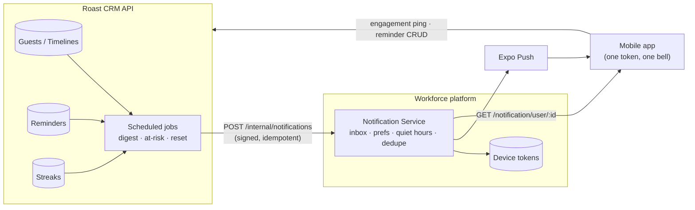
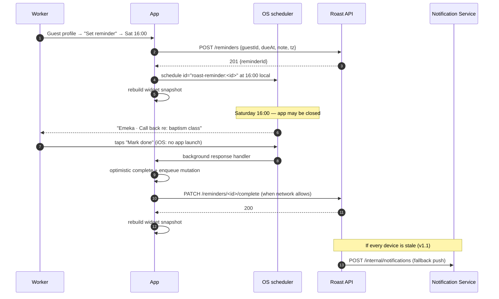
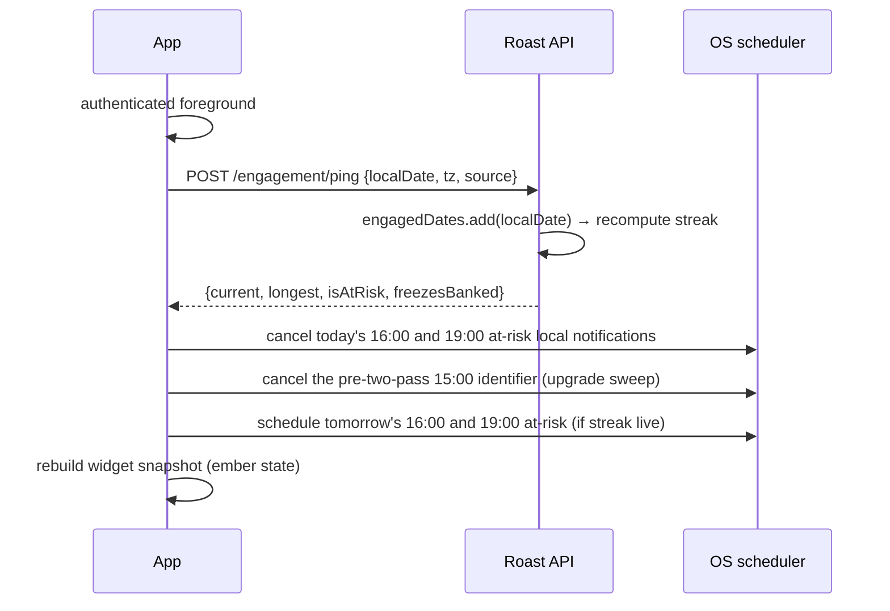

# Roast Engagement System — Architecture

Companion to [`00_TECHNICAL_PRD.md`](./00_TECHNICAL_PRD.md). This document settles *where
each responsibility lives* and *why*, and records the decisions as ADRs so a future reader
can tell a constraint from a preference.

---

## 1. The systems in play

| System | Owns today | Base URL |
|---|---|---|
| **Workforce API** | Users, campuses, departments, attendance, reports, tickets — **and device tokens** (`POST /account/device-token`) | `EXPO_PUBLIC_API_BASE_URL` |
| **Notification Service** | Inbox rows, Expo push delivery, Android channel routing, badge counts, (planned) preferences & quiet hours | Behind the Workforce API |
| **Roast CRM API** | Guests, zones, timelines, assimilation stages, leaderboards, analytics | `EXPO_PUBLIC_ROAST_API_BASE_URL` |
| **Mobile app** | One binary, two "modes" (`ops` / `roast`, see `store/actions/app.ts` and `components/ModeToggle.tsx`) | — |

The mobile app is **one app**. There is one Expo push token per handset, minted with one
`projectId`, and it is registered against the Workforce API by
`components/NotificationsProvider.tsx`. Roast is a mode inside that app, not a second app.

## 2. The one-transport rule



Roast produces *events*. The Notification Service decides whether they become a push,
which channel they land on, whether quiet hours hold them, and writes the durable inbox
row either way. Roast never talks to Expo.

## 3. Responsibility split

| Concern | Owner | Why not the other one |
|---|---|---|
| Detecting a due call / overdue follow-up | **Roast API** | It is the only system that knows what a guest is |
| Composing digest copy | **Roast API** | Copy is domain language; the platform is a transport |
| Choosing a channel, priority, badge | **Notification Service** | It owns the channel contract (`constants/notification-channels.ts`) |
| Suppressing for quiet hours / prefs | **Notification Service** | `INFRA-1` / `INFRA-2`; one implementation, all categories |
| The durable inbox row | **Notification Service** | One bell, one unread count (see [D-11](./00_TECHNICAL_PRD.md#d-11--roast-notifications-share-the-workforce-inbox-and-bell)) |
| Delivering a custom reminder at 16:00 | **Device** | Exact, offline-capable, no fan-out ([D-3](./00_TECHNICAL_PRD.md#d-3--custom-reminders--local-first-delivery-server-owned-record)) |
| Storing a custom reminder | **Roast API** | Survives reinstall, syncs across handsets, feeds the widget |
| Streak arithmetic | **Roast API** | Multi-device truth; a client-owned streak is a client-editable streak |
| The 15:00 at-risk warning | **Device (primary)**, Roast API (stale-device fallback) | The device knows about engagement that happened offline; the server does not |
| The widget snapshot | **Device** | Widgets read local storage only — see [`04_WIDGET_SPEC.md`](./04_WIDGET_SPEC.md) |

## 4. The Roast Task Feed

The spine named in the PRD. One server-computed, per-worker list that every surface reads:

```ts
type RoastTaskKind =
    | 'CALL_DUE'          // US-1.1 — derived from cadence
    | 'FOLLOW_UP'         // US-1.2 — no contact in N days
    | 'INVITE'            // US-1.3 — event in the invite window
    | 'NOTE'              // US-1.4 — interaction logged without a note
    | 'PROGRESS'          // US-1.5 — qualifying activity suggests a stage move
    | 'REMINDER';         // EPIC 2 — the worker's own

interface RoastTask {
    _id: string;
    kind: RoastTaskKind;
    guestId?: string;
    guestFirstName?: string;      // first name only — see D-10
    title: string;                 // already-composed, display-ready
    subtitle?: string;             // "3 days since last contact"
    dueAt: string;                 // ISO — sorts the feed
    isOverdue: boolean;
    deepLink: string;              // an expo-router path in KNOWN_NOTIFICATION_ROUTES
    completedAt?: string | null;
}
```

Everything downstream is a projection of this:

- **`GET /tasks/today`** → the Today screen and the widget snapshot.
- **The Morning Roast digest** → the `CALL_DUE` / `FOLLOW_UP` / `INVITE` / `PROGRESS`
  slice at 08:00, composed into one notification.
- **The widget** → the top *n* by `(isOverdue desc, dueAt asc)`, truncated to the size.
- **The streak** → a task completed is a qualifying action.

Composing copy server-side, once, is deliberate. The alternative — the client rendering
titles from a `kind` and a guest object — means the push body and the in-app row are two
implementations of one sentence, and they drift. The Workforce platform already learned
this; `INFRA-13` (copy registry) exists for the same reason.

## 5. Sequence — a custom reminder, end to end



Step 8 is the one to hold onto: **the completion is recorded locally before the network is
consulted.** A reminder marked done on a bus in a tunnel must look done — on the screen and
on the widget — immediately, or the worker marks it done again.

## 6. Sequence — the streak day boundary



The cancel-then-reschedule pair is what makes the at-risk warnings correct without a server
round trip in the afternoon. They exist on the device from the moment a streak is live and
are *removed* the instant the day is earned — so a worker who engages at 06:00 and then
loses signal still never gets warned.

**Two passes, and both halves of every pair.** Since
[`10_FRONTEND_CHANGE_NOTES.md §3`](./10_FRONTEND_CHANGE_NOTES.md) the warning fires at
16:00 *and* 19:00: the afternoon pass catches the worker who has not engaged all day, the
evening one catches the worker who meant to and did not. Cancelling one of the two is the
same bug as cancelling neither, half the time.

**The sweep is not optional.** The identifier is keyed by date *and hour*, so the key a
pre-two-pass build wrote is invisible to every cancel above — including the one that
protects the worker who has already engaged. That change shipped over the air onto devices
already holding such a notification, which is why the pair is a triple. See
[`11_DIGEST_HOURS_PLAN.md §2.2`](./11_DIGEST_HOURS_PLAN.md).

## 7. Architecture decision records

### ADR-001 — Roast does not own a push transport

**Context.** Roast has its own backend. The obvious path is for it to register its own
device tokens and send its own pushes.

**Decision.** It does not. Roast publishes to the Workforce Notification Service over a
signed internal endpoint.

**Why.** There is one Expo push token per handset, minted against one `projectId`. Two
senders holding the same token means: two systems to revoke on logout (and
`useAuth`/`NotificationsProvider` only knows about one, so the other leaks onto the next
user of a shared campus handset); two inboxes, so the bell in `TopNav` is wrong by
construction; two unread counts; two quiet-hours implementations that will disagree; two
places to add a channel; and a token rotation
(`Notifications.addPushTokenListener`) that heals one system and silently strands the
other. The rotation failure is the worst of these because it is invisible on both sides —
exactly the failure `MOBILE_NOTIFICATION_INTEGRATION.md §5.2` was written about.

**Consequences.** Roast's team depends on a Notification Service change (new categories,
new channel, an internal producer endpoint) before any nudge can ship. That dependency is
on the critical path and is the first item in
[`06_DELIVERY_PLAN.md`](./06_DELIVERY_PLAN.md).

**Fallback, if the Notification Service cannot be extended in time.** Roast writes inbox
rows into its own store and the *mobile client* merges two inboxes behind one bell. This
is strictly worse — it duplicates the unread-count logic and the merge is a client-side
sort over two paginated sources — and it should be treated as a schedule-recovery option,
not a design.

### ADR-002 — Local-first delivery for custom reminders

**Decision.** The device schedules and delivers custom reminders. The server stores them.

**Why.** "At the exact time I chose" (US-2.2) is a promise a server push cannot keep: Expo
queues, FCM/APNs batch, and a device in doze can hold a push for minutes. A local
notification fires on the OS alarm clock. It also works with no network at all, which
matters for outreach work in areas with poor coverage.

**Consequences.** iOS's 64-slot pending limit becomes a real constraint and needs a
budgeted scheduler ([`03_MOBILE_SPEC.md §4`](./03_MOBILE_SPEC.md#4-the-local-scheduler-and-the-64-slot-budget)).
A reminder created on handset A does not fire on handset B until B next syncs. A user who
never opens the app for a month has stale schedules — hence the v1.1 stale-device push.

### ADR-003 — Server owns the streak

**Decision.** Streak arithmetic runs on the Roast API. The client sends engagement pings
and renders what comes back.

**Why.** A client-computed streak is a client-editable streak (device clock), does not
survive reinstall, and is wrong the moment a worker uses a second handset. The streak is
also the input to milestones and, later, possibly to recognition — it needs to be a
number the organisation can stand behind.

**Consequences.** The streak is not readable offline unless cached. It is cached — in the
persisted Roast slice and in the widget snapshot — and rendered with a staleness rule
rather than hidden.

### ADR-004 — Two widget implementations, one snapshot contract

**Decision.** iOS: WidgetKit/SwiftUI via a config plugin. Android:
`react-native-android-widget`. Both read the same JSON snapshot from shared storage.

**Why.** iOS has no viable JS-in-widget path — WidgetKit runs in a separate extension
process with a strict memory budget and no React Native runtime. Android's RemoteViews
model is restrictive enough that a JSX-to-RemoteViews library is a genuine productivity
win with no equivalent cost. Forcing one approach across both means either hand-writing
RemoteViews XML for no benefit, or shipping nothing on iOS.

**Consequences.** Two renderers to keep visually in step. Mitigated by the snapshot being
the only input — the contract is testable in isolation, and design review happens against
two screenshots, not two codebases. Details in [`04_WIDGET_SPEC.md`](./04_WIDGET_SPEC.md).

### ADR-005 — Reuse the existing routing contract, do not invent one

**Decision.** Roast notifications carry the same `data` block every Workforce push does
(`url`, `content`, `category`, `priority`, `notificationId`) and are routed by the existing
`utils/notification-routing.ts` and `constants/notification-routes.ts`.

**Why.** `hooks/push-notifications/useNotificationObserver.ts` already handles the three
delivery paths, cold-start deduplication, the pre-auth pending queue, the session
boundary, and the already-on-this-screen guard. All of that is Roast's problem too, and
none of it is Roast-specific.

**Consequences.** New Roast routes must be added to `KNOWN_NOTIFICATION_ROUTES` in the
same commit that adds the screen, or a tapped notification lands on the notification
centre instead. That file carries a regeneration command in its header comment — use it.

### ADR-006 — The Roast tab's notification screen becomes "Today", not a second inbox

**Decision.** `/roast-crm/notifications` (currently `views/roast-crm/notifications/Notifications.tsx`,
a `return null` stub) renders the Task Feed. The inbox stays at `/notifications`.

**Why.** Two inboxes is a navigation problem the user has to solve every time. A worker
opening Roast wants "what do I do now", not "what was I told". The bell in `TopNav` is
already on every Roast screen and already carries the unread count.

**Consequences.** The mock notification data in `store/services/roast-crm.ts`
(`mockNotifications`, `mockNotificationRules`, ~120 lines) is dead and should be deleted
with this work rather than left to mislead the next reader.

## 8. Failure modes

| Failure | Behaviour | Why it is acceptable |
|---|---|---|
| Notification Service down at 08:00 | No Morning Roast push. Tasks still appear in-app and on the widget on next sync | The Task Feed is the record; push is a hint. Same posture as the Workforce inbox |
| Roast API down when the app foregrounds | Streak and tasks render from the persisted cache with a "last updated" line; engagement ping retries | Never show a wrong streak; show a stale one and say so |
| Notification permission denied | All nudges degrade to in-app + widget. Settings shows the OS path to re-enable | Required by US-1.6's constraint |
| Device clock changed | Local schedules fire at the wrong wall time; server streak is unaffected | Streak integrity is what matters; a re-sync on next foreground corrects the schedules |
| Reminder created offline | Queued in the outbox, scheduled locally immediately with a temp id, reconciled to the server id on flush | The worker's promise is kept before the network is |
| iOS 64-slot budget exceeded | The scheduler drops the furthest-future reminders, not the nearest | The next hour matters more than next month |
| Logout on a shared handset | Widget snapshot cleared, all `roast-*` local notifications cancelled, cached streak purged | Guest names must not survive a session boundary — see [D-10](./00_TECHNICAL_PRD.md#d-10--lock-screen-privacy--first-name-only-with-a-full-privacy-option) |

## 9. Security & privacy notes

- **Shared storage is not a secure store.** The widget snapshot lives in an App Group
  container (iOS) / `SharedPreferences` (Android), readable by anything with the group id.
  It carries first names and task titles — never phone numbers, addresses, notes, or the
  auth token.
- **Logout must clear it.** `hooks/auth` already clears AsyncStorage and dispatches
  `clearSession`; the snapshot and the local notification queue join that path. This is
  the same shared-handset concern `NotificationsProvider` was hardened for.
- **The internal producer endpoint is service-to-service.** Signed (HMAC or mTLS), never
  reachable from a client token, and idempotent on `dedupeKey` so a job retry cannot
  double-send.
- **Roast rows in the inbox are user-scoped**, never broadcast. There is no legitimate
  Roast broadcast, and a guest name in a broadcast row would leak across campuses.
