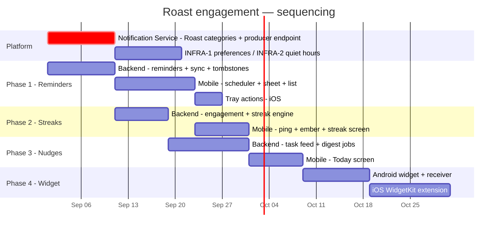

# Roast Engagement System — Delivery Plan

Phasing, sequencing, risks and test plan. Estimates are engineer-weeks and assume one
backend engineer and one mobile engineer working in parallel, plus design ahead of both.

---

## 1. The critical path

**The one blocking dependency is the Notification Service change** (ADR-001): new
categories, new Android channels, and the signed internal producer endpoint. Nothing in
EPIC 1 or EPIC 4 can be delivered without it. Start it in week one regardless of which
phase the team picks up first.

Everything else is deliberately ordered so each phase ships something a worker can use.

## 2. Phases

### Phase 0 — Platform prerequisites · ~2 weeks · **blocking**

| Task | Owner |
|---|---|
| Add `ROAST_ENGAGEMENT` / `ROAST_REMINDER` / `ROAST_STREAK` categories | Notification Service |
| Add `roast-nudges` / `roast-reminders` / `roast-streak` Android channels to `constants/notification-channels.ts` | Mobile |
| Signed, idempotent `POST /internal/notifications` producer endpoint | Notification Service |
| Extend preferences (`INFRA-1`) and quiet hours (`INFRA-2`) with Roast categories | Notification Service |
| Backfill `nextCallDueAt` on all guests; add `callCadenceDays` | Roast API |
| Add the four new routes to `KNOWN_NOTIFICATION_ROUTES` | Mobile |

> ⚠️ **Ship the Android channels in a build before any Roast push is sent.** Android
> silently drops a notification addressed to a channel the device has never created — no
> error to the app, nothing in the Expo receipt. The Workforce rollout already hit this;
> the flag holding channel routing off exists because of it.

### Phase 1 — Custom reminders (EPIC 2) · ~3 weeks · **ship first**

The highest value-per-unit-risk in the whole set: it depends on no detection heuristics,
no digest tuning, no cadence model, and no product decisions still open. It is also the
only epic whose value is entirely self-evident to a worker on day one.

Delivers US-2.1 through US-2.6, plus iOS tray actions.

**Definition of done:** a worker sets a reminder from a guest profile, it fires at the
exact minute with the app closed, they mark it done from the tray without opening the app
(iOS) or with a one-second launch (Android), and it appears completed and timestamped in
that guest's history.

### Phase 2 — Streaks (EPIC 4) · ~2 weeks

US-4.1 through US-4.5. Grace days (US-4.6) held for v1.5 per [D-9](./00_TECHNICAL_PRD.md#d-9--grace-day-us-46--recommend-shipping-it-in-v15).

Ships second because it is self-contained, gives the Today screen its header before Today
exists, and the engagement-ping data starts accumulating the qualifying-action history
that [D-1](./00_TECHNICAL_PRD.md#d-1--streak-qualification--confirm-app-open-but-record-both-from-day-one) depends on. Every week it ships earlier is a week of data we do not have to wait for later.

### Phase 3 — Engagement nudges (EPIC 1) · ~4 weeks

The Task Feed, the Today screen, the Morning Roast and evening prompt. Highest product
risk in the set — the heuristics decide whether workers trust it or mute it — so it ships
after two phases have already earned some trust.

**Roll out behind a flag, to a pilot zone first.** Watch the opt-out rate and the
notification-volume p95 for two weeks before widening. Those are the guardrail metrics in
[PRD §6](./00_TECHNICAL_PRD.md#6-success-metrics), and this is the phase that moves them.

### Phase 4 — Widget (EPIC 3) · ~4 weeks

Android first (§4 of [`04_WIDGET_SPEC.md`](./04_WIDGET_SPEC.md)) — cheaper, larger share of
this user base, and its native receiver is shared with the Android tray actions D-8
defers. iOS second.

**Do the snapshot contract in Phase 1.** It is pure app-side code, it is small, and having
it already correct is what turns Phase 4 into rendering work instead of a rewrite.

### v1.5 — Follow-ups

Grace days · Android background tray actions · stale-device fallback push · zone-level
coordinator digests · the streak tightening from open-to-qualifying-action, informed by
the data D-1 has been collecting since Phase 2.

## 3. Ticket breakdown

### Backend

| ID | Title | Est |
|---|---|---|
| `RE-B1` | Guest cadence fields + `nextCallDueAt` derivation + backfill migration | 3d |
| `RE-B2` | `roast_reminders` model, CRUD, validation, idempotent create | 4d |
| `RE-B3` | `/reminders/sync` with tombstones + `roast_device_sync` | 3d |
| `RE-B4` | `roast_engagement_days` + `/engagement/ping` | 3d |
| `RE-B5` | Streak engine: recompute, travel grace, rollover job | 4d |
| `RE-B6` | Streak history / heatmap endpoint | 2d |
| `RE-B7` | Task feed: detection queries per kind, `/tasks/today` | 5d |
| `RE-B8` | `roast_nudge_receipts` + the dedupe-key discipline | 2d |
| `RE-B9` | Morning Roast job + copy shape selection | 4d |
| `RE-B10` | Evening note prompt job | 2d |
| `RE-B11` | Timezone bucketing for all scheduled jobs | 3d |
| `RE-B12` | Preferences endpoints (or proxy to `INFRA-1`) | 2d |
| `RE-B13` | Producer integration with the Notification Service | 3d |
| `RE-B14` | Milestones + (v1.5) grace days | 3d |
| `RE-B15` | Observability: per-type counters, the two day-one alerts | 2d |

### Mobile

| ID | Title | Est |
|---|---|---|
| `RE-M1` | `roast-engagement` RTK service + slice + store registration | 2d |
| `RE-M2` | Local scheduler with the 64-slot budget + ledger diff | 4d |
| `RE-M3` | Reminder sheet (create/edit) + Yup schema + chips | 3d |
| `RE-M4` | My Reminders screen + swipe actions | 3d |
| `RE-M5` | `GuestRemindersCard` + "Set reminder" in `GuestHeader` | 2d |
| `RE-M6` | Notification categories + tray action handling + outbox | 3d |
| `RE-M7` | Offline outbox flush + reconciliation | 3d |
| `RE-M8` | Engagement ping hook (foreground + qualifying actions) | 2d |
| `RE-M9` | Skia ember, three states, reduced-motion | 3d |
| `RE-M10` | Streak screen + Skia heatmap + reset card | 3d |
| `RE-M11` | At-risk local notification schedule/cancel | 2d |
| `RE-M12` | Today screen + `TaskRow` + sections + empty states | 5d |
| `RE-M13` | Tab layout change; retire the Notifications stub; delete the roast mocks | 1d |
| `RE-M14` | Notification settings screen | 3d |
| `RE-M15` | Widget snapshot writer + logout clear | 2d |
| `RE-M16` | Copy registry | 1d |
| `RE-M17` | Routes into `KNOWN_NOTIFICATION_ROUTES` + param dictionary update | 1d |

### Native / widget

| ID | Title | Est |
|---|---|---|
| `RE-N1` | `react-native-android-widget` plugin + three layouts | 5d |
| `RE-N2` | Android `BroadcastReceiver` — widget completion **and** tray actions | 4d |
| `RE-N3` | `@bacons/apple-targets` + App Group + entitlements + EAS credentials | 3d |
| `RE-N4` | WidgetKit views, three families, five states | 6d |
| `RE-N5` | iOS timeline provider with per-`dueAt` entries | 3d |
| `RE-N6` | iOS 17 App Intents for completion, with the pre-17 fallback | 3d |

## 4. Risk register

| Risk | Likelihood | Impact | Mitigation |
|---|---|---|---|
| **Notification Service cannot take Roast categories in time** | Medium | Blocks EPIC 1 + 4 | Start Phase 0 in week one. Fallback in [ADR-001](./01_ARCHITECTURE.md#adr-001--roast-does-not-own-a-push-transport) — schedule recovery only |
| **Nudge heuristics are wrong; workers mute the category** | Medium | Feature dies quietly | Pilot zone + the ≤8% opt-out guardrail before widening |
| **iOS 64-slot limit silently drops reminders** | High if unhandled | Users lose trust with no error to report | Budgeted scheduler (`RE-M2`) + an explicit test case |
| **Widget scope overruns** | High | Slips everything behind it | Widget is last; the reduced-scope ladder in [`04_WIDGET_SPEC.md §9`](./04_WIDGET_SPEC.md#9-reduced-scope-if-the-timeline-slips) |
| **Android channels ship after the first push** | Medium | Notifications silently dropped | Channels in Phase 0, in a build, before any send |
| **Cadence defaults are wrong for this ministry** | Medium | Nudge volume badly over or under | Confirm with discipleship team (open question 2); make them server config, not constants |
| **Reanimated LayoutAnimations crash Android** | High if used | Hard crash on the new screens, no JS stack | Documented ban in [`05_UX_SPEC.md §9`](./05_UX_SPEC.md#9-motion); property animations only |
| **Guest names leak via the widget snapshot after logout** | Low | Privacy incident on a shared handset | Clear-and-update in the `useAuth` teardown; explicit QA case |
| **Duplicate digests from job retries** | Medium | The most visible possible failure | Receipt insert as the guard, asserted before emit |
| **No test runner in the repo** | Certain | Regressions land unnoticed | Minimal jest setup for the scheduler and streak helpers (`03_MOBILE_SPEC.md §11`) |

## 5. Test plan

### Must be automated

The three places where a bug produces *silence* rather than a failure:

1. **Scheduler diff** — given a local ledger and a server list, produces the right
   cancel/schedule/reschedule set; respects the 60-slot budget; drops the furthest, never
   the nearest.
2. **Streak day boundaries** — same-day repeat, consecutive days, one-day gap, the 36-hour
   travel grace (both directions), reset, freeze spend, longest preservation.
3. **Digest copy shape selection** — 1 / 2–3 / 4+ tasks, `hideGuestNames` on, absent
   `gender` producing they/them.

### Manual matrix

| Scenario | iOS | Android | Expected |
|---|---|---|---|
| Reminder fires, app force-quit | ✓ | ✓ | Fires within 60s of the set time |
| Reminder fires in airplane mode | ✓ | ✓ | Fires — local, not push |
| Mark done from tray | ✓ | ✓ | iOS: no launch. Android: brief launch + toast |
| Mark done offline, then reconnect | ✓ | ✓ | Stays done; syncs; never reappears |
| Tap notification, cold start | ✓ | ✓ | Lands on the guest, reminder in view, once — not twice |
| Tap notification while on that guest | ✓ | ✓ | No duplicate screen pushed |
| 80 upcoming reminders | ✓ | — | Nearest 60 scheduled; tail tops up as the head fires |
| Travel Lagos → Sydney mid-streak | ✓ | ✓ | Streak survives |
| Device clock moved forward a day | ✓ | ✓ | Server streak unaffected; schedules corrected on next foreground |
| Engage at 06:00, wait past 15:00 | ✓ | ✓ | No at-risk warning |
| Deny notification permission | ✓ | ✓ | Today + widget still work; settings card shows the OS path |
| Logout with widget installed | ✓ | ✓ | Widget shows signed-out within seconds; no guest names remain |
| Quiet hours active when a digest fires | ✓ | ✓ | No push; inbox row still written; bell updates |
| Worker with zero assigned guests | ✓ | ✓ | No nudges at all |

### Pre-launch load check

Run `morningRoast` against a production-sized snapshot for the largest timezone bucket.
Measure wall-clock duration and the emit count, and confirm the job is resumable from its
receipts after a forced mid-run kill.

## 6. Rollout

1. **Internal** — the alpha-tester cohort already gated in `TopNav` (`isAlphaTester`), one
   week.
2. **Pilot zone** — one zone, all four phases as they land, two weeks each. Watch opt-out
   rate and volume p95 daily.
3. **Campus** — one campus, two weeks.
4. **Global** — behind a server-side flag that can disable each nudge type independently.
   Per-type kill switches, not one master switch: the ability to turn off *the progress
   nudge* at 09:00 on a Sunday without taking custom reminders down with it is what makes
   a bad heuristic a footnote instead of an incident.
